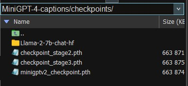
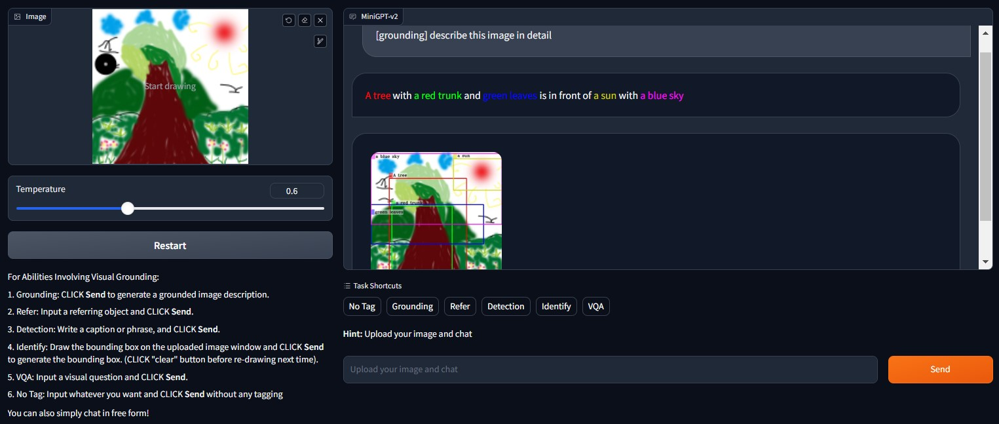

# MiniGPT-4-captions

## Introduce
Our project leverages [MiniGPT-v2](https://github.com/Vision-CAIR/MiniGPT-4) and custom scripts to address the challenge of dataset annotation by automatically generating captions for images. By utilizing this powerful language model, we aim to alleviate the time-consuming and labor-intensive task of manually annotating large datasets.  

Join us on this project as we harness the capabilities of MiniGPT-v2 scripts to revolutionize dataset annotation and advance the field of computer vision. Together, we can overcome the challenges of dataset annotation and explore the potential of automated image caption generation.  

## Getting Started
### Installation
**1. Prepare the code and the environment**  
You can git clone MiniGPT-v2 repository or our repository, creating a conda virtual environment according to official instructions.
```bash
# git clone https://github.com/Vision-CAIR/MiniGPT-4.git
# cd MiniGPT-4

# To avoid unnecessary code, it is recommended to clone our repository
git clone https://github.com/bbbdbbb/MiniGPT-4-captions.git
cd MiniGPT-4-captions
conda env create -f environment.yml
conda activate minigptv
```

**2. Download pre-train checkpoint**  
You need to download the corresponding file from the official website. If you encounter any problems, you can tell me your problem through "[issues](https://github.com/bbbdbbb/MiniGPT-4-captions/issues)" and I will help solve it.  

  

**3. Edit config file** 
In the [model config file](minigpt4/configs/models/minigpt_v2.yaml#L14), specify the path to [Llama-2](https://huggingface.co/meta-llama/Llama-2-7b-chat-hf).
```
# set Llama-2-7b-chat-hf path
llama_model: "/home/bbbdbbb/project/MiniGPT-4-main/checkpoints/Llama-2-7b-chat-hf"
```

In the [evaluation config file](eval_configs/minigptv2_eval.yaml#L8), specify the path to [pretrained checkpoint of MiniGPT-v2](https://drive.google.com/file/d/1aVbfW7nkCSYx99_vCRyP1sOlQiWVSnAl/view).  
```
# set pretrained checkpoint path
ckpt: "/home/bbbdbbb/project/MiniGPT-4-main/checkpoints/minigptv2_checkpoint.pth"
```

### Running Demo
You can run the official provided demo using the following code to experience the capabilities of the model.  
```
python demo_v2.py --cfg-path eval_configs/minigptv2_eval.yaml  --gpu-id 0
```
  


## Generating Captions
You can see that MiniGPT is very powerful in terms of functionality. However, due to the complexity of the model's network input design, batch generation of captions is not possible directly. Therefore, we have developed a series of scripts based on the Gradio module used in the Demo, which can assist you in automatically generating captions for your dataset.  

### Single Image
**1. Simple experience**  
You can generate captions for images at a specified path by using the following [code](MiniGPTv2_annotate.py#L230), which provides a simple way to experience our script.
```
# Generate caption based on one image
image_path = "./data/examples_v2/cockdial.png"
prompt = f"What animal is in the picture?"
annotation = Generate4img(chat, image_path, prompt)
```
### Multiple Images
**1. Generate images caption**  
If you want to generate captions for your image dataset in bulk, please make sure to have a [text file](data/heco/heco.txt) containing the information about the images. You can then execute the following [code](MiniGPTv2_annotate.py#L235).
```
# Generate caption based on images file
image_file_path = "./data/heco/images"
label_file_path = "./data/heco/heco.txt"
save_annatation_path = "./data/heco/heco.json"
questions = [
    "What are the people doing in the picture?",
    "What activities can be observed in the picture with the people?",
    "How would you describe the actions of the individuals in the image?",
    "Could you give me some details about the person's activity captured in the picture?",
    "Please identify the specific actions or tasks being performed by the individuals in the picture.",
]
annotation = Generate4imgs(chat, image_file_path, label_file_path, save_annatation_path, questions)
```
To avoid the single-mindedness and bias in the generated captions by the model, you can set multiple questions. Our script will randomly select a question as the prompt during runtime. The final results will be saved in a [JSON file](data/heco/heco.json).  


